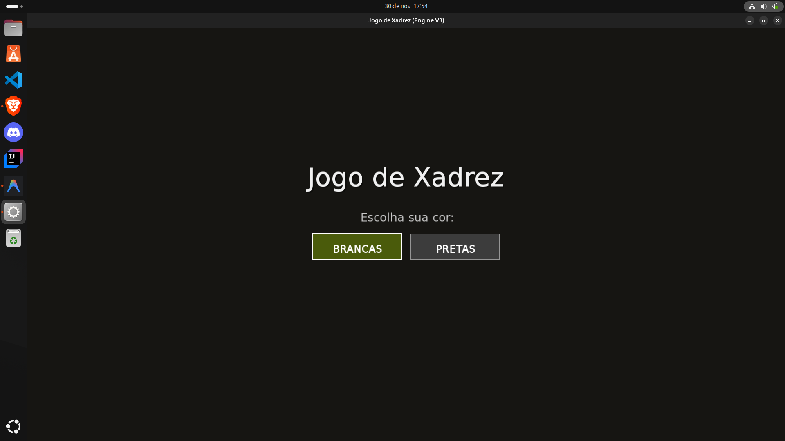
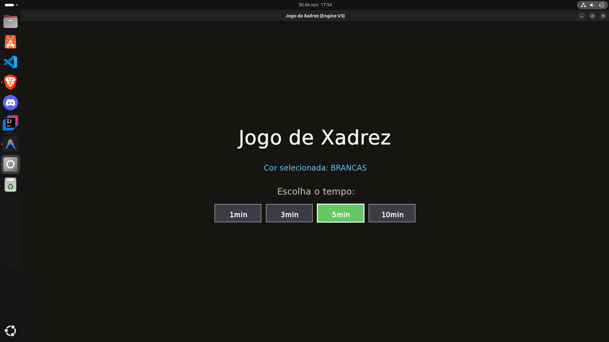
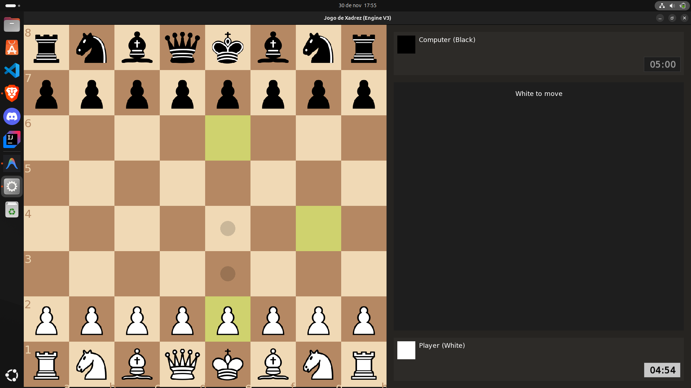
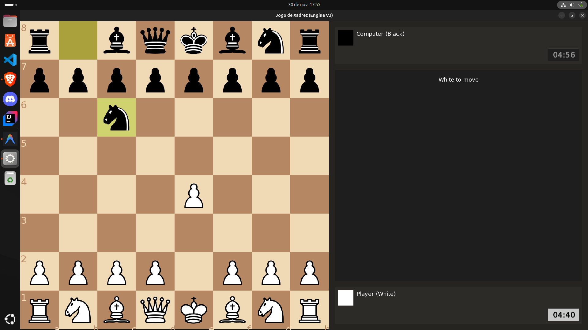

# Chess Engine

**Disciplina:** Introdução à Inteligência Artificial  
**Semestre:** 2025.2  
**Professor:** André Fonseca  
# Chess Engine

**Disciplina:** Introdução à Inteligência Artificial  
**Semestre:** 2025.2  
**Professor:** André Fonseca  
**Turma:** T04

## Integrantes do Grupo
* Enzo Araújo de Souza e Oliveira (20250063249)
* Pedro Lucas Maia de Paiva (20240004960)

## Descrição do Projeto
Este projeto consiste em uma **Engine de Xadrez completa desenvolvida em C++**, capaz de jogar xadrez em alto nível utilizando algoritmos avançados de Inteligência Artificial. O sistema foi projetado para ser modular e eficiente, suportando tanto execução via console quanto uma interface gráfica interativa.

Principais características:
*   **Interface Gráfica (GUI):** Desenvolvida com a biblioteca **SFML**, oferecendo uma experiência visual interativa.
*   **Protocolo UCI:** Suporte ao *Universal Chess Interface*, permitindo integração com plataformas como Lichess (via `lichess-bot`).
*   **Inteligência Artificial:** Implementação robusta utilizando:
    *   Algoritmo **Negamax** com **Poda Alpha-Beta** para busca eficiente.
    *   **Busca de Quiescência** para evitar o efeito horizonte em trocas de peças.
    *   **Tabelas de Transposição (TT)** para memorizar posições já avaliadas.
    *   **Ordenação de Movimentos** com heurísticas de *Killer Moves* e *History Heuristic*.
    *   **Tabelas de Peça-Quadrado (PST)** para avaliação posicional refinada.

## Guia de Instalação e Execução

### Pré-requisitos
*   **Compilador C++17** (ex: g++, clang++)
*   **Biblioteca SFML** (necessária apenas para a interface gráfica)
    *   Ubuntu/Debian: `sudo apt-get install libsfml-dev`
    *   Windows: Baixar do site oficial ou usar gerenciador de pacotes.

### Compilação
* Linux/WSL:  
O projeto utiliza um `Makefile` para facilitar a compilação. No terminal, execute:

```bash
# Clone o repositório
git clone [https://github.com/enzoustk/chess-bot]

# Entre na pasta do projeto
cd chess-bot

# Compilar versão com Interface Gráfica
make gui

# Compilar versão apenas Console (sem SFML)
make
````
* Windows:  
Basta executar o arquivo compile_gui.bat dando dois cliques ou via terminal:
```DOS
compile_gui.bat
```

### 2. Como Executar
* Modo Gráfico: Para abrir o jogo com o tabuleiro visual

```bash
# Linux
./chess --gui

# Windows
chess.exe --gui
```
* Modo Console: Para jogar via terminal ou testar a lógica:
```bash
# Linux
./chess

# Windows
chess.exe
```

## Estrutura dos Arquivos

  * `src/`: Código-fonte da aplicação ou scripts de processamento.
  * `img/pieces/`: Imagens, peças do tabuleiro.
  * `img/tests/`: Imagens, testes do Engine.

## Resultados e Demonstração

Abaixo, uma demonstração da interface gráfica desenvolvida com SFML:  
* Menu inicial da aplicação:
  

* Menu de escolha para o tempo de partida:


* Print de partidas jogadas:
  



## Referências

  * [Link para o Dataset original]
  * [Artigo, Documentação ou Tutorial utilizado como base]